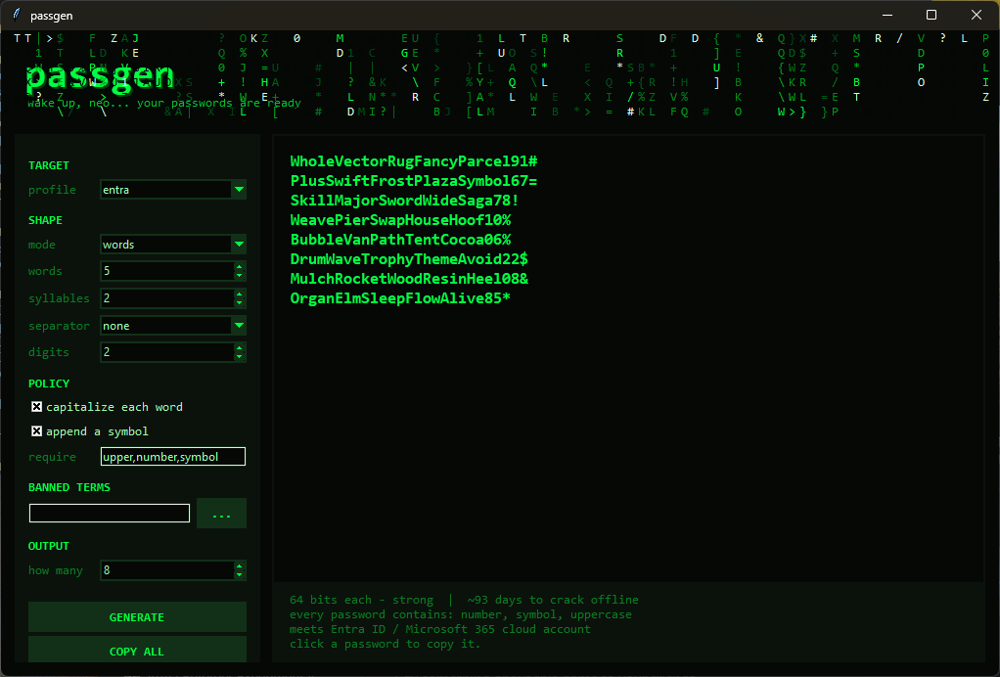

# passgen

[](https://github.com/Revg1794/passgen/actions/workflows/tests.yml)


**Passwords you can actually remember and type — that still pass your company's
password rules.**



> **Work in progress.** This is an early, actively changing project. It has not
> been independently audited, flags and defaults may change without notice, and
> the platform rules it encodes are read from Microsoft's public documentation
> rather than from any official API. Review it yourself before you rely on it
> for anything that matters, and treat the compliance checks as a convenience,
> not a guarantee.

---

## What is this?

Most password generators hand you something like `xK7#mQ2$pL9!vB4@`. It's
strong, and it's miserable — you can't remember it, you can't read it to someone
over the phone, and you'll mistype it twice before giving up and pasting it.

passgen makes passwords out of **real words instead**:

```
WholeVectorRugFancyParcel91#
PlusSwiftFrostPlazaSymbol67=
SkillMajorSwordWideSaga78!
```

Same idea as the [famous xkcd comic](https://xkcd.com/936/): a handful of random
words is both easier for a human and harder for a computer than a short mess of
symbols. These are actually **stronger** than the `xK7#mQ2$pL9!` example above,
while being far easier to type.

Every password it makes contains a capital letter, a number and a special
character, so it satisfies the complexity rules most workplaces enforce.

---

## Quick start

### The easy way (Windows, nothing to install)

1. Go to [**Releases**](https://github.com/Revg1794/passgen/releases) and
   download **`passgen.exe`**.
2. Double-click it.

That's the whole thing — no Python, no setup. The window in the screenshot opens
with eight passwords ready. **Click any password to copy it.**

> **Windows will probably warn you.** The file isn't code-signed (certificates
> cost money), so SmartScreen may say *"Windows protected your PC"* — click
> **More info → Run anyway**. Some antivirus tools also flag PyInstaller
> executables generically. If that makes you uncomfortable, use the source
> install below instead: it's the same code, and you can read every line of it.

### With Python (any OS)

```bash
pip install git+https://github.com/Revg1794/passgen.git
passgen            # the command line
passgen-gui        # the window
```

### From source (any OS)

Install [Python](https://www.python.org/downloads/) — on Windows, tick
**"Add python.exe to PATH"** in the installer, which is easy to miss. Then click
the green **Code** button above → **Download ZIP**, extract it, and:

- **Windows:** double-click `passgen-gui.cmd`
- **macOS / Linux:** `python3 -m passgen.gui` (or `python3 -m passgen` for the
  command line)

There are no dependencies to install — passgen is standard library only.

<details>
<summary><b>Double-clicking did nothing, or a black window flashed past</b></summary>

Python probably isn't on your PATH. Reinstall Python and make sure
**"Add python.exe to PATH"** is ticked. To see the actual error, open a terminal
in the folder (Shift + right-click the folder → *Open PowerShell window here*)
and run `python -m passgen.gui` — the message will tell you what's wrong.
</details>

<details>
<summary><b>The window won't open on Linux</b></summary>

Tkinter ships separately on some distributions:
`sudo apt install python3-tk`. The command-line tool (`python3 -m passgen`)
works without it.
</details>

---

## Using the window

| Control | What it does |
| --- | --- |
| **profile** | Sets everything up for a particular kind of account — see [Microsoft accounts](#for-microsoft-admins) below. Leave it on `entra` for work accounts, or pick `none` to choose your own settings. |
| **mode** | `words` uses real words. `syllables` invents pronounceable fake ones like `ToveDidpaTerni` — useful when a website limits how long your password can be. |
| **words** | How many words. More words = stronger. 5 is a good default; use 7 for something important. |
| **separator** | What goes between words. `none` runs them together (`WholeVectorRug`), `dash` gives `whole-vector-rug`. |
| **digits** | How many numbers to add at the end. |
| **require** | Categories every password must contain. Leave as-is unless you have a reason. |
| **how many** | How many passwords to show, so you can pick one you like. |

**Click a password to copy it.** *COPY ALL* copies the whole batch. *GENERATE*
(or just pressing Enter) makes a fresh set.

Two things the window does for safety:

- **The clipboard clears itself 30 seconds after you copy.** If you've copied
  something else in the meantime, it leaves your clipboard alone.
- **HIDE (screen share)** masks the passwords on screen as `********` while
  still letting you click a row to copy the real one — useful when someone is
  watching your screen.

---

## Which settings should I use?

| I need a password for... | Use this |
| --- | --- |
| A work Microsoft 365 / Office account | profile `entra` |
| A personal Outlook, Hotmail or Xbox account | profile `msa` |
| A company Windows login | profile `ad` |
| My password manager's master password | profile `none`, **words 7** |
| Something I have to read out over the phone | separator `space`, symbol off |
| A website that rejects long passwords | mode `syllables` |

---

## Understanding the numbers

The status line at the bottom says something like:

```
64 bits each - strong  |  ~93 days to crack offline
```

**Bits** measure how hard a password is to guess. Each extra bit **doubles** the
work an attacker has to do, so the jump from 50 to 64 bits isn't 28% harder —
it's about 16,000 times harder. Rough guide:

| Bits | Verdict | Good enough for |
| --- | --- | --- |
| under 45 | weak | nothing important |
| 45-60 | ok | ordinary logins that lock out after a few bad guesses |
| 60-80 | strong | work accounts, email |
| 80+ | very strong | password manager master passwords, disk encryption |

**"Days to crack" is the pessimistic case**, not a prediction. It assumes an
attacker has stolen the password database, is guessing offline at a trillion
attempts per second, *and* knows you used this exact tool with these exact
settings. A real attacker guessing at a login page gets nowhere near that. The
number is there to be compared between settings, not taken literally.

One deliberate honesty note: **capitalising words adds nothing.** Turning
`glue` into `Glue` follows a rule an attacker already knows, so passgen counts
it as zero extra security. It's there to satisfy password policies and to keep
words readable, and the tool says so rather than inflating the score.

---

## Command line

Everything the window does, the terminal does too:

```
passgen                    5 words, a capital, digits and a symbol
passgen -n 10              show ten to choose from
passgen -p entra           for a Microsoft 365 work account
passgen -w 7               longer: for a master password
passgen -s dash            put dashes back between words
passgen --help             every option
```

On Windows, `passgen.cmd` works from any folder once you add the folder to your
PATH:

```powershell
[Environment]::SetEnvironmentVariable('Path', $env:Path + ';C:\path\to\passgen', 'User')
```

Passwords go to standard output and the summary to standard error, so
`passgen -q -n 20 > passwords.txt` writes a clean file, and
`passgen -q -n 1 | Set-Clipboard` copies one straight to the clipboard.

---

## For Microsoft admins

This part is aimed at people managing Entra ID / Microsoft 365 tenants. If
that's not you, you can stop reading here — the defaults are already sensible.

`-p` picks a platform profile, sets appropriate defaults, **and verifies every
password against that platform's real rules** before printing it. Explicit flags
override the profile, so `-p entra -w 7` does what you'd expect.

| Profile | Target | Rules enforced | Example | Entropy |
| --- | --- | --- | --- | --- |
| `entra` | Entra ID / Microsoft 365 cloud accounts | 8-256 chars, 3 of 4 character categories | `AvoidPaperErrorWonderPick92+` | ~64 bits |
| `ad` | On-prem Active Directory, default domain policy | 7-127 chars, 3 of 5 categories | `PatrolBraveLodgeSeedCycle53*` | ~64 bits |
| `msa` | Consumer Microsoft accounts (outlook.com, hotmail, live, Xbox) | 8-**16** chars, 2 of 4 categories | `PuwoZanviKinni4%` | ~53 bits |

**The consumer 16-character cap is the interesting one.** Entra lifted its old
16-character limit years ago, but consumer Microsoft accounts still stop at 16 —
a normal passphrase simply doesn't fit. The `msa` profile therefore switches to
invented pronounceable words, which carry roughly twice the entropy per
character that real words do. Three short words plus a digit and a symbol was
the best of six layouts measured. ~53 bits is close to the practical ceiling for
something memorable inside 16 characters, so on a consumer Microsoft account
**MFA is doing the real work, not the password.**

Every symbol and separator passgen emits (`- . _`, space, `!?#$%&*+=`) is on the
Entra ID allowed-character list.

### Banned terms

Entra ID Password Protection can reject a password a generator happily produced.
passgen runs the same evaluation locally and regenerates instead, so you find
out here rather than at the password-change prompt:

```
passgen -p entra -b my-terms.local.txt              # a custom banned list
passgen -p entra --ban contoso --ban widget         # inline terms
passgen -p entra --name "Jane Smith" --name contoso # user / tenant names
```

`passgen/banned.py` implements the algorithm Microsoft documents:

1. **Normalize** — lowercase, then substitute `0`→`o`, `1`→`l`, `$`→`s`, `@`→`a`.
2. **Fuzzy match** every banned term at an **edit distance of 1**, so banning
   `contoso` also catches `C0ntoso`, `contos0`, `contosoo` and `Contos`.
3. **Substring match** names and tenant terms of 4+ characters.
4. **Score** — one point per banned term found, one point per remaining
   character; fewer than 5 points is rejected.

Both worked examples from Microsoft's documentation reproduce exactly:
`C0ntos0Blank12` scores 4 (rejected), `ContoS0Bl@nkf9!` scores 5 (accepted).

Copy `banned-example.txt` to `my-terms.local.txt` and put your organisation's
real terms there — `.gitignore` excludes `*.local.txt`, so your banned list
never lands in a repository.

**What this does and does not tell you:**

- Microsoft **deliberately does not publish the global banned list**, so this
  checks only the terms *you* supply. It can confirm a password doesn't trip on
  your custom terms; it cannot promise Entra will accept it.
- The substitution table is published as an example ("such as"), not a complete
  list, and Microsoft states the algorithm can change at any time. No extra
  leetspeak rules are invented here — guessing them would reject passwords Entra
  accepts without catching the ones it rejects.
- **In practice this rarely changes the output.** A 30-character passphrase
  clears 5 points even if every word were banned. It matters mainly for short
  passwords: `-p msa` is 16 characters, where two banned words plus a separator
  scores 3 and is rejected.

---

## How it works

<details>
<summary><b>Why these particular words</b></summary>

The list is 1,779 words, filtered for typing comfort and recall: 3-7 letters,
common enough to picture, spelled the way they sound, and free of near-homophone
pairs that leave you guessing which one you picked. No digits are buried inside
words; the digits and symbol go in a fixed, predictable place at the end so you
always know where they live.

Word boundaries come from CamelCase rather than separators: `HumblePointTape`
reads back over the phone, `humblepointtape` does not.
</details>

<details>
<summary><b>Where the randomness comes from</b></summary>

Python's `secrets` module, which draws from the operating system's
cryptographically secure random number generator. The ordinary `random` module
is **never** used for passwords — the only thing that touches it is the falling-
code animation in the GUI, which is commented as such at the import.
</details>

<details>
<summary><b>How the entropy figure is calculated</b></summary>

- Capitalisation is priced at **zero** bits, because it's a deterministic rule.
- Candidates rejected by a length cap or a banned term are regenerated. That
  rejection sampling is unbiased, but it shrinks the space, so
  `measure_entropy()` samples the real acceptance rate and subtracts the lost
  bits rather than quoting an inflated number.
- The figure is the entropy of the *distribution*, not of one sample. In
  syllables mode the bit count is path-dependent (a consonant-final rime
  restricts the next onset to 19 choices instead of 34), so a single sample's
  count would swing by a couple of bits between runs.
</details>

<details>
<summary><b>The GUI shares the CLI's code</b></summary>

`passgen/gui.py` imports `passgen/cli.py` and `passgen/banned.py` rather than reimplementing
anything. The controls are translated into a command-line argument list and
handed to `passgen.parse_args()`, so the GUI inherits the profile precedence,
validation and error messages, and the two cannot drift apart.
</details>

---

## Known limitations

- **The word list is the weakest link.** 1,779 words gives 10.8 bits per word,
  against [Diceware's](https://theworld.com/~reinhold/diceware.html) 7,776 words
  and 12.9 bits. Expanding it while keeping the typeability rules is the
  highest-value improvement available — see the open issue.
- Not independently audited.
- The platform rules are transcribed from Microsoft's public documentation and
  could fall out of date if Microsoft changes them.

Issues and pull requests are welcome.

---

## Development

```bash
python -m unittest discover -s tests -v     # 54 tests, no dependencies
```

The suite covers the two worked examples from Microsoft's documentation, the
fuzzy matching rules, every profile's compliance with its own platform limits,
the `--require` guarantee, and the entropy maths — including a test asserting
that capitalisation adds exactly zero bits, so the README's honesty claim is
enforced by the build rather than by good intentions. Several tests are
regressions for bugs that shipped: `--help` crashing on the `%` in `SYMBOLS`,
the entropy figure being read from a single sample, and the error message
blaming the wrong filter.

CI runs on Windows, macOS and Linux across Python 3.9 and 3.12.

To build the standalone executable:

```bash
pip install pyinstaller
pyinstaller --onefile --windowed --name passgen tools/exe_entry.py
```

## Licence

MIT — see [LICENSE](LICENSE). Use it for anything, no warranty.

## Files

- `passgen/cli.py` — command-line tool
- `passgen/gui.py` — Matrix-themed desktop GUI
- `passgen/wordlist.py` — the 1,779 curated words
- `passgen/banned.py` — Entra Password Protection evaluation
- `banned-example.txt` — template for your own banned-term list
- `tests/` — the test suite
- `passgen.cmd` / `passgen-gui.cmd` — Windows launchers
